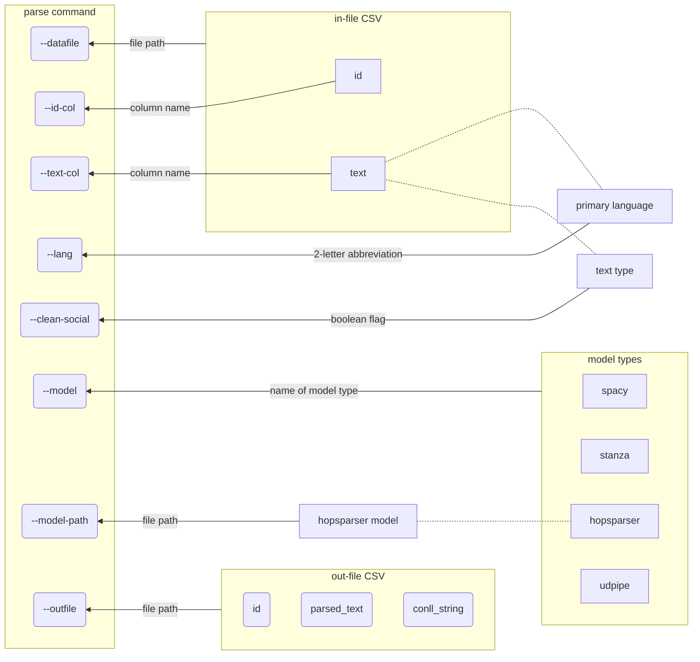
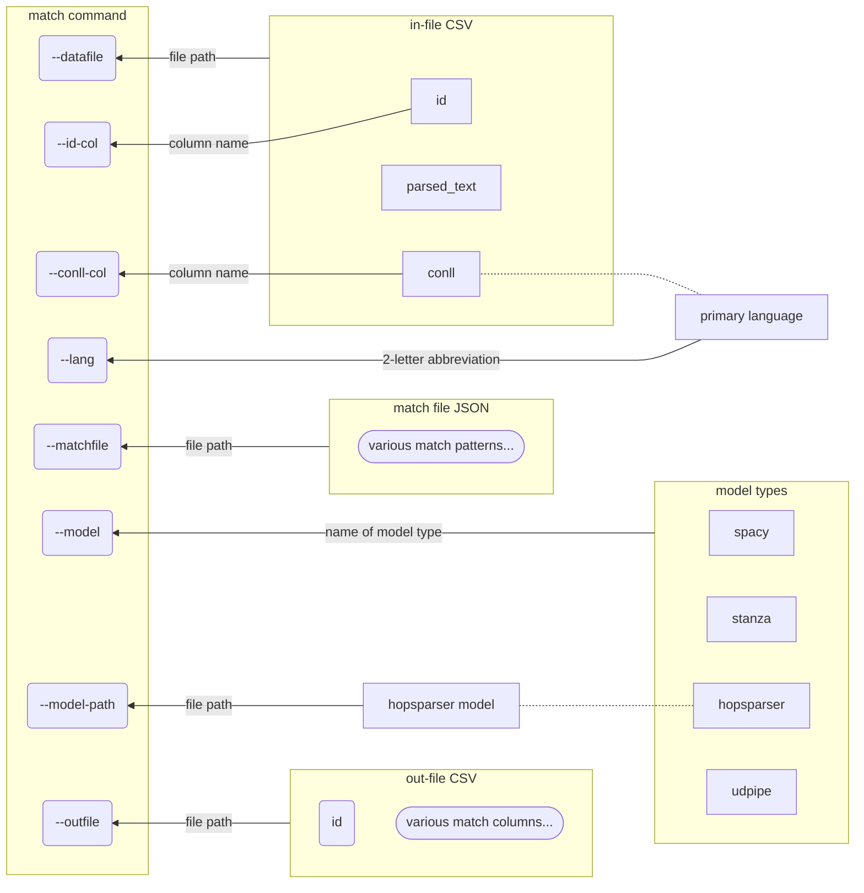

# Qui fait quoi ?

## Tools to detect syntactic relationships in French and English

`keyfayqua` is a Command Line tool that features 2 commands. First, the `parse` command annotates a corpus of texts, detecting entities and dependency relationships, and outputs each document's annotations as a [CoNLL-formatted](https://universaldependencies.org/format.html) string in the column of a CSV file. Second, the `match` command reconverts the CoNLL string into a SpaCy object and, using [Semgrex patterns](https://aclanthology.org/2023.tlt-1.7/) and SpaCy's [`DependencyMatcher`](https://spacy.io/api/dependencymatcher/), detects dependency relationships between nodes in the parsed sentences. By providing Semgrex patterns, the user chooses the types of relationships that will be searched with the `match` command.

1. [How to install](#install)
2. [How to use](#usage)
   1. [`parse` command](#keyfayqua-parse--initially-parse-texts) (intially parse the text documents)
   2. [`test-conll` command](#keyfayqua-test-conll--test-conll-string-validity) (test CoNLL string validity)
   3. [`match` comand](#keyfayqua-match--match-dependency-patterns) (apply Semgrex patterns to match syntactic relationships)
   4. [Match output](#match-output)
3. [Optional pre-processing](#optional-pre-processing)

## Install

1. Create and activate a virtual Python environment (>=3.11).
2. Clone this repository.

```shell
git clone https://github.com/medialab/keyfayqua.git
```

3. Install `keyfayqua` in the activated virtual environment.

```
pip install --upgrade pip
pip install -e .
```

4. On Mac, whose MPS GPU is not yet supported, I recommend you install two additional libraries to (slightly) improve performace:
   - `pip install thinc-apple-ops`
   - `pip install spacy[apple]`

## Usage

### `keyfayqua parse` : Initially parse texts

The `parse` command is the first step to detecting dependency relationship patterns. It takes in a corpus of text documents, given as a CSV file, and outputs CoNLL-formatted string representations of the parsed documents, also in a CSV file. Optionally, with the `--clean-social` flag, you can [pre-process](#optional-pre-processing) the text with a cleaning script designed for social media posts, specifically Twitter. For help, type `keyfayqua parse --help`.



_Note about Hopsparser French models:_

> By selecting the model type `hopsparser` and the French language (`fr`), you will need a Hopsparser model. If you do not have one, the script will download one for you. The default model is the [`Flaubert` model for Spoken french](https://zenodo.org/record/7703346/files/UD_all_spoken_French-flaubert.tar.xz?download=1) and the default download location is in this repository at `./hopsparser_model/UD_all_spoken_French-flaubert/`. If you want to use another of the Hopsparser models, you can download it yourself and provide the path with the option `--model-path`.

Upon completion or exit of the `parse` command, the CSV file to which the program had been writing each text document's annotations will be compressed using Gzip. The out-file is expected to be very large despite having only 3 columns:

1. an identifier for the text document, given with the option `--id-col`
2. the version of the text that was parsed
3. the CoNLL-formatted string

### `keyfayqua test-conll` : Test CoNLL string validity

Sometimes it's useful to quickly test the integrity of your CoNLL format. The command `test-conll` requires the path to the file whose strings you want to test, and optionally the name of the strings' column if other than the default "conll_string". The program will raise an error and show you the problematic string if it finds an invalid CoNLL format. Otherwise it will exit upon completion.

```shell

╭─ Options ───────────────────────────────────────────────────╮
│ *  --datafile         FILE  Path to file with Conll results │
│                             [default: None]                 │
│                             [required]                      │
│    --conll-col        TEXT  CoNLL string column name        │
│                             [default: conll_string]         │
│    --help                   Show this message and exit.     │
╰─────────────────────────────────────────────────────────────╯

```

### `keyfayqua match` : Match dependency patterns

After creating a data file with annotated tokens correctly formatted in CoNLL strings, you're ready to apply [Semgrex](https://nlp.stanford.edu/nlp/javadoc/javanlp/edu/stanford/nlp/semgraph/semgrex/SemgrexPattern.html) matches and detect syntactic relationships. First, you'll need a JSON file with a set of Semgrex match patterns. See an example [here](#composing-the-semgrex-file). Then, you'll call the `match` command, as explained [here](#calling-the-match-command).

#### Composing the Semgrex file

The Semgrex file's JSON format closely resembles the format that SpaCy uses in Python for their DependencyMatcher.

In both cases, a pattern is composed of an array of nodes, in which the order matters. The array's first node is the "anchor" node, to which all other nodes relate, either directly or indirectly. Subsequent nodes have a relationship to the anchor or another preceding node.

In both SpaCy's Python dictionary and `keyfayqua`'s JSON format, the ordered array of nodes looks like the following example, which is taken from [SpaCy's documentation](https://spacy.io/usage/rule-based-matching#dependencymatcher):

```json
[
  {
    "RIGHT_ID": "founded",
    "RIGHT_ATTRS": { "ORTH": "founded" }
  },
  {
    "LEFT_ID": "founded",
    "REL_OP": ">",
    "RIGHT_ID": "subject",
    "RIGHT_ATTRS": { "DEP": "nsubj" }
  },
  {
    "LEFT_ID": "founded",
    "REL_OP": ";",
    "RIGHT_ID": "initially",
    "RIGHT_ATTRS": { "ORTH": "initially" }
  }
]
```

Whereas in Python the pattern's array of nodes is attributed to a variable, in the JSON format, the array is the value in a JSON key-value pair wherein the key is the pattern's identifying name.

```json
{
  "PatternName": [
    {
      "RIGHT_ID": "founded",
      "RIGHT_ATTRS": { "ORTH": "founded" }
    },
    {
      "LEFT_ID": "founded",
      "REL_OP": ">",
      "RIGHT_ID": "subject",
      "RIGHT_ATTRS": { "DEP": "nsubj" }
    },
    {
      "LEFT_ID": "founded",
      "REL_OP": ";",
      "RIGHT_ID": "initially",
      "RIGHT_ATTRS": { "ORTH": "initially" }
    }
  ]
}
```

#### Calling the `match` command

Even though you're applying the Semgrex patterns to a corpus that is already parsed, SpaCy's DependencyMatcher still requires a language model. Consequently, the `match` command resembles the `parse` command. For more information, ask for help with the command `keyfayqua match --help`.



#### Match output

The CSV output by the `match` command is dynamically formatted to have as many columns as are necessary to store information about the patterns you provide. A Semgrex pattern has at least 2 nodes, an anchor and something that relates to it. For every node in the pattern, there will be 6 columns.

1. `PatternName_NodeName_id` : the token's index
2. `PatternName_NodeName_lemma` : the token's lemma (or text if the model failed to lemmatize it)
3. `PatternName_NodeName_pos` : the token's part-of-speech tag
4. `PatternName_NodeName_deprel` : the token's dependency relationship to its head
5. `PatternName_NodeName_entity` : the token's named-entity-recognition label
6. `PatternName_NodeName_noun_phrase` (in development)

Each match on a Semgrex pattern is written to a row of the CSV, along with the text document's unique ID.

| id                  | FindRootSubjects_ROOT_id | FindRootSubjects_ROOT_lemma | FindRootSubjects_ROOT_pos | FindRootSubjects_ROOT_deprel | FindRootSubjects_ROOT_entity | FindRootSubjects_ROOT_noun_phrase | FindRootSubjects_SUBJECT_id | FindRootSubjects_SUBJECT_lemma | FindRootSubjects_SUBJECT_pos | FindRootSubjects_SUBJECT_deprel | FindRootSubjects_SUBJECT_entity | FindRootSubjects_SUBJECT_noun_phrase |
| ------------------- | ------------------------ | --------------------------- | ------------------------- | ---------------------------- | ---------------------------- | --------------------------------- | --------------------------- | ------------------------------ | ---------------------------- | ------------------------------- | ------------------------------- | ------------------------------------ |
| 1598065358522699776 | 18                       | launch                      | VERB                      | ROOT                         |                              |                                   | 17                          | we                             | PRON                         | nsubj                           |                                 |                                      |

---

### Optional pre-processing

The original text may be cleaned if the flag `--clean-social` is provided with the `parse` command. This flag adds an extra step in which the text is pre-processed with a [normalizing script](src/utils/normalizer.py) designed for social media text documents, specifically Tweets. The normalizer applies the following changes:

1. remove emojis

```python
>>> import emoji
>>>
>>> text = 'ChatGPT-4 : plus de 1000 prompts 🤯 pour améliorer votre #création https://openai.com/blog/chatgpt via @siecledigital'
>>>
>>> emoji.replace_emoji(text, replace='')
'ChatGPT-4 : plus de 1000 prompts  pour améliorer votre #création https://openai.com/blog/chatgpt via @siecledigital'
```

2. separate titles / pre-colon spans from sentences [`(^(\w+\W+){1,2})*:`]

```python
>>> import re
>>>
>>> text = 'ChatGPT-4 : plus de 1000 prompts  pour améliorer votre #création https://openai.com/blog/chatgpt via @siecledigital'
>>>
>>> re.sub(r'(^(\w+\W+){1,2})*:', '\\1.', text)
'ChatGPT-4 . plus de 1000 prompts  pour améliorer votre #création https.//openai.com/blog/chatgpt via @siecledigital'
```

3. remove URLs

```python
>>> from ural.patterns import URL_IN_TEXT_RE
>>>
>>> text = 'ChatGPT-4 . plus de 1000 prompts  pour améliorer votre #création https.//openai.com/blog/chatgpt via @siecledigital'
>>>
>>> URL_IN_TEXT_RE.sub(repl='', string=text)
'ChatGPT-4 . plus de 1000 prompts  pour améliorer votre #création https. via @siecledigital'
```

4. remove citations at the end of a post [`(?!https)via(\s{0,}@\w*)`]

```python
>>> import re
>>>
>>> text = 'ChatGPT-4 . plus de 1000 prompts  pour améliorer votre #création https. via @siecledigital'
>>>
>>> re.sub(r"(?!https)via(\s{0,}@\w*)", "", text)
'ChatGPT-4 . plus de 1000 prompts  pour améliorer votre #création https. '
```

5. remove # and @ signs [`[@#]`]

```python
>>> import re
>>>
>>> text = 'ChatGPT-4 . plus de 1000 prompts  pour améliorer votre #création https. '
>>>
>>>re.sub(r'[@#]', '',  text)
'ChatGPT-4 . plus de 1000 prompts  pour améliorer votre création https. '
```

6. remove trailing white space

```python
>>> text = 'ChatGPT-4 . plus de 1000 prompts  pour améliorer votre création https. '
>>>
>>> text.strip()
'ChatGPT-4 . plus de 1000 prompts  pour améliorer votre création https.'
```

7. remove double spaces

```python
>>> text = 'ChatGPT-4 . plus de 1000 prompts  pour améliorer votre création https.'
>>>
>>> re.sub(r'\s+', ' ', text)
'ChatGPT-4 . plus de 1000 prompts pour améliorer votre création https.'
```

Original text:

> ChatGPT-4 : plus de 1000 prompts 🤯 pour améliorer votre #création https://openai.com/blog/chatgpt via @siecledigital

Cleaned text:

> ChatGPT-4 . plus de 1000 prompts pour améliorer votre création https.'

CoNLL result:

| ID  | FORM      | LEMMMA    | UPOS  | XPOS  | FEATS                     | HEAD | DEPREL | DEPS | MISC |
| --- | --------- | --------- | ----- | ----- | ------------------------- | ---- | ------ | ---- | ---- |
| 1   | ChatGPT-4 | chatgpt-4 | PROPN | ADJ   | Gender=Fem \| Number=Sing | 0    | ROOT   | \_   | \_   |
| 2   | .         | .         | PUNCT | PUNCT | \_                        | 1    | punct  | \_   | \_   |

| ID  | FORM      | LEMMMA    | UPOS  | XPOS  | FEATS                       | HEAD | DEPREL | DEPS | MISC |
| --- | --------- | --------- | ----- | ----- | --------------------------- | ---- | ------ | ---- | ---- |
| 1   | plus      | plus      | ADV   | ADV   | \_                          | 4    | advmod | \_   | \_   |
| 2   | de        | de        | ADP   | ADP   | \_                          | 3    | case   | \_   | \_   |
| 3   | 1000      | 1000      | NUM   | PRON  | NumType=Card                | 1    | iobj   | \_   | \_   |
| 4   | prompts   | prompt    | NOUN  | VERB  | Tense=Pres \| VerbForm=Part | 0    | ROOT   | \_   | \_   |
| 5   | pour      | pour      | ADP   | ADP   | \_                          | 6    | mark   | \_   | \_   |
| 6   | améliorer | améliorer | VERB  | VERB  | VerbForm=Inf                | 4    | acl    | \_   | \_   |
| 7   | votre     | votre     | DET   | DET   | Number=Sing \| Poss=Yes     | 8    | det    | \_   | \_   |
| 8   | création  | création  | NOUN  | NOUN  | Gender=Fem \| Number=Sing   | 6    | obj    | \_   | \_   |
| 9   | https     | https     | INTJ  | PROPN | Gender=Masc \| Number=Sing  | 8    | nmod   | \_   | \_   |
| 10  | .         | .         | PUNCT | PUNCT | \_                          | 4    | punct  | \_   | \_   |

### Model citations

#### Hopsparser (French)

```bibtex
@inproceedings{grobol:hal-03223424,
    title = {{Analyse en dépendances du français avec des plongements contextualisés}},
    author = {Grobol, Loïc and Crabbé, Benoît},
    url = {https://hal.archives-ouvertes.fr/hal-03223424},
    booktitle = {{Actes de la 28ème Conférence sur le Traitement Automatique des Langues Naturelles}},
    eventtitle = {{TALN-RÉCITAL 2021}},
    venue = {Lille, France},
    pdf = {https://hal.archives-ouvertes.fr/hal-03223424/file/HOPS_final.pdf},
    hal_id = {hal-03223424},
    hal_version = {v1},
}
```

#### Stanza (English)

```bibtex
@inproceedings{qi2020stanza,
    title={Stanza: A {Python} Natural Language Processing Toolkit for Many Human Languages},
    author={Qi, Peng and Zhang, Yuhao and Zhang, Yuhui and Bolton, Jason and Manning, Christopher D.},
    booktitle = "Proceedings of the 58th Annual Meeting of the Association for Computational Linguistics: System Demonstrations",
    year={2020}
}
```
